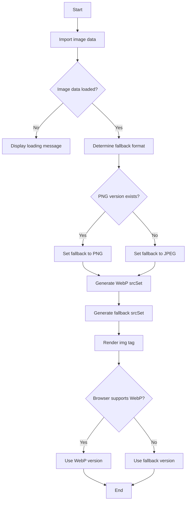

# Preact Responsive Image Project

[](https://vercel.com/new/git/external?repository-url=https://github.com/jameswquinn/preact-responsive-images)

This project demonstrates a Preact application that uses responsive images with WebP support and intelligent fallback to PNG or JPEG based on alpha channel presence.

## Table of Contents

- [File Structure](#file-structure)
- [Setup](#setup)
- [How It Works](#how-it-works)
- [API](#api)
- [FAQ](#faq)
- [Deployment](#deployment)

## File Structure

```
project-root/
│
├── src/
│   ├── components/
│   │   └── ResponsiveImage.js
│   ├── index.js
│   └── index.html
│
├── public/
│   └── images/
│       └── large_original.png
│
├── webpack.config.js
├── package.json
├── .babelrc
├── vercel.json
└── README.md
```

## Setup

1. Clone the repository:
   ```
   git clone https://github.com/jameswquinn/preact-responsive-images.git
   cd preact-responsive-images
   ```

2. Install dependencies:
   ```
   npm install
   ```

3. Start the development server:
   ```
   npm start
   ```

4. Build for production:
   ```
   npm run build
   ```

## How It Works

The following flowchart illustrates the process of how the responsive image component works:



This flowchart shows:
1. The initial loading of image data
2. The decision process for determining the fallback format
3. The generation of srcSet for WebP and fallback formats
4. The final rendering and browser decision on which format to use

This process ensures that the most appropriate image format and size is delivered to the user, balancing quality and performance.

## API

### ResponsiveImage Component

The `ResponsiveImage` component is the core of this project. It handles the responsive loading of images with WebP support and appropriate fallbacks.

#### Props

- `src` (string, required): The filename of the image in the `public/images/` directory.
- `alt` (string, required): The alt text for the image.

#### Usage

```jsx
import ResponsiveImage from './components/ResponsiveImage';

function App() {
  return (
    <div>
      <h1>Hello, World!</h1>
      <ResponsiveImage src="large_original.png" alt="A responsive image" />
    </div>
  );
}
```

### Webpack Configuration

The Webpack configuration in `webpack.config.js` handles the intelligent generation of responsive images. It processes all image files in the `public/images/` directory as follows:

- Creates WebP versions for all images in sizes: 300w, 600w, 1200w, 2000w
- Creates PNG versions only for images with an alpha channel
- Creates JPEG versions only for images without an alpha channel

#### Key features:

- Intelligent format selection based on image characteristics
- Multiple sizes for responsive loading: 300w, 600w, 1200w, 2000w
- WebP creation for all images for browsers that support it
- Uses `responsive-loader` and `sharp` for efficient image processing

## FAQ

Q: Why use WebP?
A: WebP offers superior compression and quality compared to PNG and JPEG, resulting in smaller file sizes and faster load times.

Q: What happens if a browser doesn't support WebP?
A: The component automatically falls back to PNG or JPEG, depending on whether the original image had an alpha channel.

Q: How does the component decide between PNG and JPEG fallback?
A: If the original image had an alpha channel, it falls back to PNG. Otherwise, it uses JPEG for better compression.

Q: Can I use this with images other than PNG?
A: Yes, the setup processes both PNG and JPEG input files. It will generate appropriate formats based on the characteristics of each input image.

Q: How can I change the generated image sizes?
A: Modify the `sizes` array in the Webpack configuration file.

Q: How does the image processing decide which formats to generate?
A: The Webpack configuration analyzes each image. It always creates WebP versions, creates PNG versions only for images with an alpha channel, and creates JPEG versions only for images without an alpha channel.

## Deployment

This project is set up for easy deployment to Vercel. Click the "Deploy with Vercel" button at the top of this README to deploy your own instance.

### Vercel Configuration

This project includes a `vercel.json` configuration file for easy deployment to Vercel. This configuration:

- Sets up the build process to use Vercel's static build system.
- Specifies that the build output is in the `dist` directory.
- Configures routing to support a single-page application structure.

To deploy to Vercel:

1. Push your code to a GitHub repository.
2. Visit vercel.com and import your GitHub project.
3. Vercel will automatically detect the configuration and deploy your app.

Alternatively, you can use the Vercel CLI for deployment:

1. Install the Vercel CLI: `npm i -g vercel`
2. Run `vercel` in your project directory.
3. Follow the prompts to deploy your app.

For other deployment options:

1. Build the project:
   ```
   npm run build
   ```

2. The `dist/` directory will contain the built project, which can be deployed to any static hosting service.

## Contributing

Contributions are welcome! Please feel free to submit a Pull Request.

## License

This project is open source and available under the [MIT License](LICENSE).
